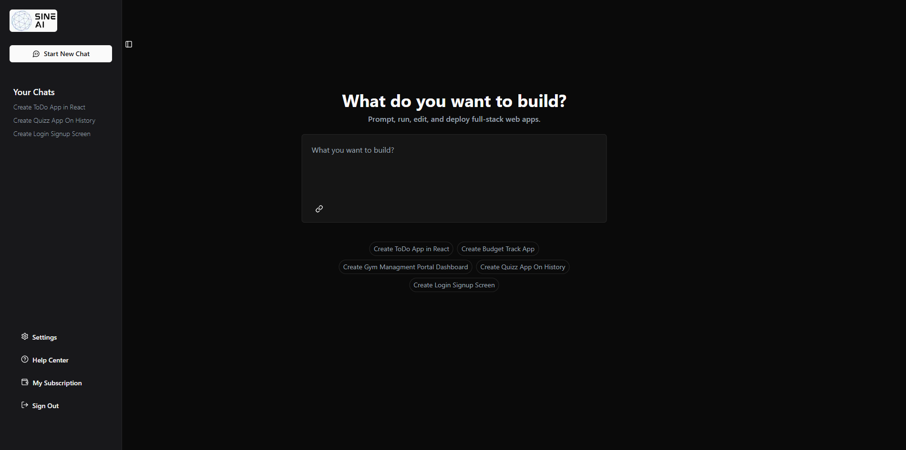
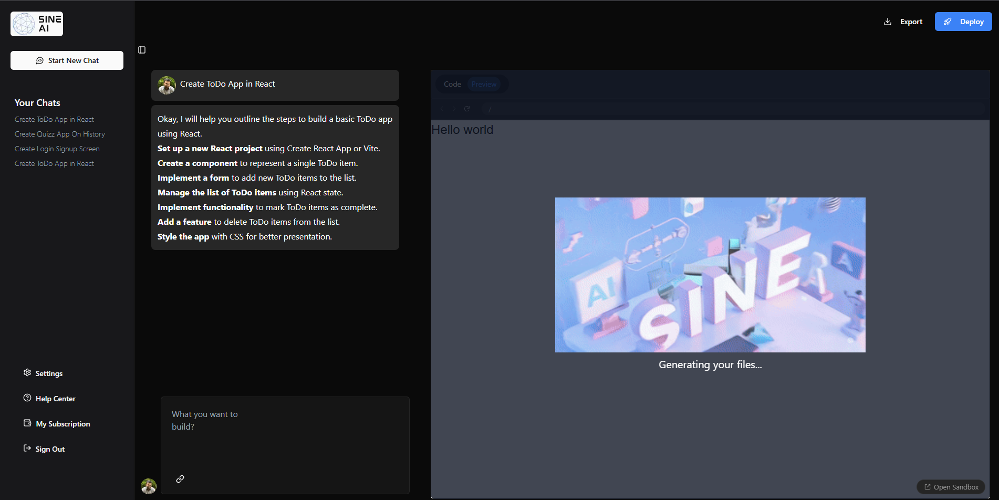
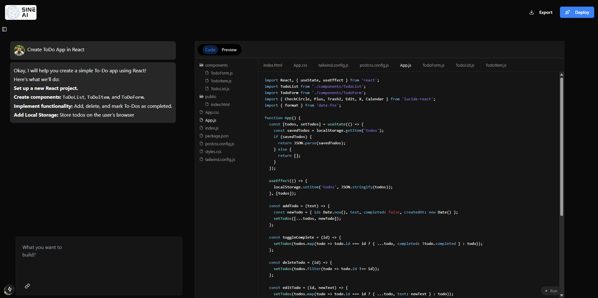
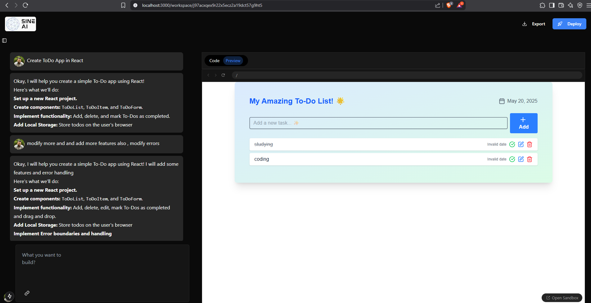

# SINE AI Code 🤖✨

**SINE AI Code** is an innovative AI-powered code generator that allows you to prompt, run, edit, and deploy full-stack web applications directly in your browser. Inspired by tools like `bolt.new`, SINE AI Code aims to streamline the development process by leveraging artificial intelligence to generate code and provide an online environment for execution and modification.

**Live Demo:** [https://sine-ai-code.vercel.app/](https://sine-ai-code.vercel.app/)

This is a [Next.js](https://nextjs.org) project bootstrapped with [`create-next-app`](https://github.com/vercel/next.js/tree/canary/packages/create-next-app).

---

## 💡 What do you want to build?

Simply type your project idea or the component you want to build into the prompt, and let SINE AI Code generate the initial codebase for you.



---

## 🚀 Generating Your Code

Once you provide a prompt, SINE AI Code gets to work, utilizing powerful AI to understand your requirements and generate the necessary code files.



---

## 💻 Code & Preview

After generation, you'll be presented with an intuitive interface showing the file structure and the generated code. You can review, edit, and see a live preview of your application.



The live preview updates as you make changes, allowing for rapid iteration and development.



---

## ✨ Features

* **AI-Powered Code Generation:** Describe your app, and SINE AI Code will generate the foundational code.
* **Online IDE:** Edit and refine your code directly in the browser.
* **Live Preview:** Instantly see the results of your code changes.
* **File Management:** View and manage the generated project files and structure.
* **Interactive Chat:** Refine and modify your project through an interactive chat interface, including adding features and handling errors.

---

## 🛠️ Technologies Used

* **Next.js:** For the powerful and flexible React framework.
* **Gemini API:** Leveraging Google's cutting-edge AI for code generation.
* **Sandbox Environment:** To safely run and preview the generated applications.
* **Geist Font:** This project uses [`next/font`](https://nextjs.org/docs/app/building-your-application/optimizing/fonts) to automatically optimize and load [Geist](https://vercel.com/font), a new font family for Vercel.

---

## 🚀 Getting Started (For Local Development)

If you want to run this project locally or contribute:

First, ensure you have Node.js and npm/yarn/pnpm/bun installed. Then, run the development server:

```bash
npm run dev
# or
yarn dev
# or
pnpm dev
# or
bun dev
